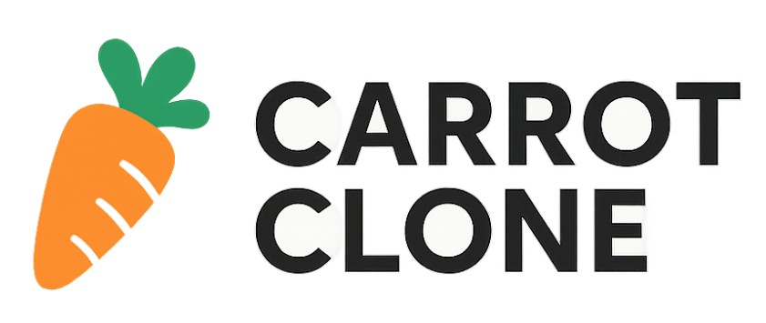

<!-- BANNER -->
<p align="center">
  
</p>

<h1 align="center">🪙 COIN TRACKER</h1>
<p align="center">
  <b>Next.js와 Tailwinds CSS를 이용한 당근마켓 클론코딩</b>
</p>

<p align="center">
  
  
  
  
  
  
  
</p>

---

##  기능
- 🌈 게시물 등록 및 확인
- 📃 등록자와 채팅으로 대화나누기
- ✏️ 게시물 정렬 기능 리스트업
---

##  기술 스택
<p align="center">
  
  
  
  
  
  
      <label
        className="mb-1 block text-sm font-medium text-gray-700"
        htmlFor={name}
      >
        {label}
      </label>
      {kind === "text" ? (
        <div className="rounded-md relative flex  items-center shadow-sm">
          <input
            id={name}
            {...rest}
            className="appearance-none w-full px-3 py-2 border border-gray-300 rounded-md shadow-sm placeholder-gray-400 focus:outline-none focus:ring-orange-500 focus:border-orange-500"
          />
        </div>
      ) : null}
      {kind === "price" ? (
        <div className="rounded-md relative flex  items-center shadow-sm">
          <div className="absolute left-0 pointer-events-none pl-3 flex items-center justify-center">
            <span className="text-gray-500 text-sm">$</span>
          </div>
          <input
            id={name}
            {...rest}
            className="appearance-none pl-7 w-full px-3 py-2 border border-gray-300 rounded-md shadow-sm placeholder-gray-400 focus:outline-none focus:ring-orange-500 focus:border-orange-500"
          />
          <div className="absolute right-0 pointer-events-none pr-3 flex items-center">
            <span className="text-gray-500">KRW</span>
          </div>
        </div>
      ) : null}
      {kind === "phone" ? (
        <div className="flex rounded-md shadow-sm">
          <span className="flex items-center justify-center px-3 rounded-l-md border border-r-0 border-gray-300 bg-gray-50 text-gray-500 select-none text-sm">
            +82
          </span>
          <input
            id={name}
            {...rest}
            className="appearance-none w-full px-3 py-2 border border-gray-300 rounded-md rounded-l-none shadow-sm placeholder-gray-400 focus:outline-none focus:ring-orange-500 focus:border-orange-500"
          />
        </div>
      ) : null}
    </div>
  );
}
```

